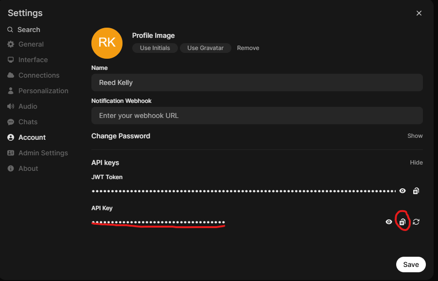

# Open WebUI CLI Tool

A command-line interface for interacting with Open WebUI API.

## Setup

1. Clone this repository
2. Install dependencies: `pip install -r requirements.txt`
3. Set your API key and base URL in the `.env` file:
   ```
   OPEN_WEBUI_API_KEY = "your_api_key_here"
   BASE_URL = "http://localhost:3000/api"
   ```

## Getting your API Key

You can find your API key in the Open WebUI settings page:



## Usage

```bash
# Upload a knowledge document
python oweb.py upload path/to/document.pdf

# List all knowledge documents
python oweb.py list-knowledge

# List available models
python oweb.py list-models

# Ask a question (with optional knowledge documents)
python oweb.py ask "What is the capital of France?" --model gpt-3.5-turbo
python oweb.py ask "Summarize this document" --model gpt-4 --knowledge doc_id_1 doc_id_2
```

## Requirements

- Python 3.6+
- Open WebUI instance running (default: http://localhost:3000)
